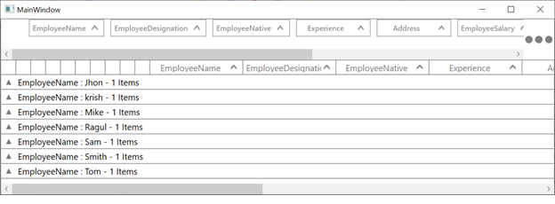

# how-to-enable-the-horizontal-scroll-bar-in-wpf-data-grid-grop-drop-area
How to enable the horizontal scroll bar in WPF DataGrid (SfDataGrid) GropDropArea?

By default, the scroll bar for GroupDropArea will be enabled. To avail horizontal scroll bar in GroupDropArea, the default style of ScrollViewer for GroupDropArea can be customized with ScrollbarVisibility as true.

```
<ScrollViewer x:Name="PART_ScrollViewer"
              CanContentScroll="True" 
              FlowDirection="{TemplateBinding FlowDirection}"
              VerticalScrollBarVisibility="Hidden"
              IsDeferredScrollingEnabled="{TemplateBinding ScrollViewer.IsDeferredScrollingEnabled}"
              IsTabStop="False"                                          
              PanningMode="{TemplateBinding ScrollViewer.PanningMode}"
              PanningRatio="{TemplateBinding ScrollViewer.PanningRatio}"
              >
<ScrollViewer.Style>
     <Style TargetType="{x:Type ScrollViewer}">
         <Style.Triggers>
             <DataTrigger Binding="{Binding Path=IsExpanded,RelativeSource={RelativeSource TemplatedParent}}"  Value="False">
                 <Setter Property="HorizontalScrollBarVisibility" Value="Hidden" />
             </DataTrigger>
             <DataTrigger  Binding="{Binding Path=IsExpanded,RelativeSource={RelativeSource TemplatedParent}}"  Value="True">
                 <Setter Property="HorizontalScrollBarVisibility" Value="Visible" />
             </DataTrigger>
         </Style.Triggers>

     </Style>
 </ScrollViewer.Style>
```


