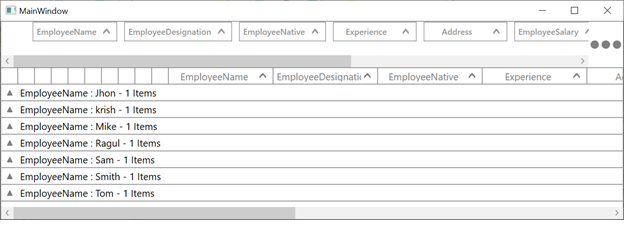

# How to Enable the Horizontal ScrollBar in WPF DataGrid GroupDropArea?

This sample show cases how to enable the horizontal scroll bar in [WPF DataGrid](https://www.syncfusion.com/wpf-controls/datagrid) (SfDataGrid) GropDropArea.

The scroll bar for [GroupDropArea](https://help.syncfusion.com/cr/wpf/Syncfusion.UI.Xaml.Grid.GroupDropArea.html) is disabled in `DataGrid`. To enable the horizontal scroll bar in `GroupDropArea`, the default style of ScrollViewer for `GroupDropArea` can be customized with `ScrollbarVisibility` as true.

```xml
<ScrollViewer x:Name="PART_ScrollViewer"
              CanContentScroll="True" 
              FlowDirection="{TemplateBinding FlowDirection}"
              VerticalScrollBarVisibility="Hidden"
              IsDeferredScrollingEnabled="{TemplateBinding ScrollViewer.IsDeferredScrollingEnabled}"
              IsTabStop="False"                                          
              PanningMode="{TemplateBinding ScrollViewer.PanningMode}"
              PanningRatio="{TemplateBinding ScrollViewer.PanningRatio}" >
<ScrollViewer.Style>
     <Style TargetType="{x:Type ScrollViewer}">
         <Style.Triggers>
             <DataTrigger Binding="{Binding Path=IsExpanded,RelativeSource={RelativeSource TemplatedParent}}"  Value="False">
                 <Setter Property="HorizontalScrollBarVisibility" Value="Hidden" />
             </DataTrigger>
             <DataTrigger  Binding="{Binding Path=IsExpanded,RelativeSource={RelativeSource TemplatedParent}}"  Value="True">
                 <Setter Property="HorizontalScrollBarVisibility" Value="Visible" />
             </DataTrigger>
         </Style.Triggers>
     </Style>
 </ScrollViewer.Style>
```

